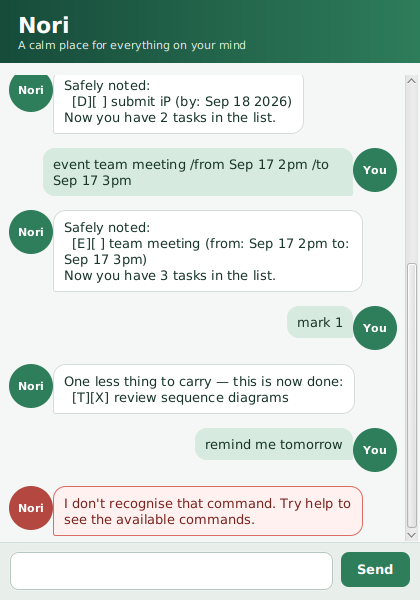

# Nori User Guide

Nori is a friendly desktop task tracker that keeps todos, deadlines, and events in one quiet place. Type short commands into the box at the bottom of the window and Nori will save your task list automatically.



## Quick start

1. Download `nori.jar` from the latest GitHub release.
2. Make sure Java 25 is installed.
3. Open a terminal in the folder containing the JAR and run:

   ```text
   java -jar nori.jar
   ```

4. Type `help` to see the available commands.

Nori stores tasks in `data/nori.txt`, relative to the folder from which you launch it. The file and its parent folder are created automatically.

## Command summary

| Action | Command |
|---|---|
| Add a todo | `todo DESCRIPTION` |
| Add a deadline | `deadline DESCRIPTION /by YYYY-MM-DD` |
| Add an event | `event DESCRIPTION /from START /to END` |
| Show all tasks | `list` |
| Find tasks | `find KEYWORD` |
| Mark a task done | `mark NUMBER` |
| Mark a task not done | `unmark NUMBER` |
| Delete a task | `delete NUMBER` |
| Show command help | `help` |
| Exit Nori | `bye` |

Commands are not case-sensitive. `TODO read a book` and `todo read a book` work the same way.

## Adding a todo

Use `todo` for a task without a date.

```text
todo read chapter 6
```

Nori adds the task and shows the new number of tasks in your list.

## Adding a deadline

Use `deadline` for work that must be completed by a particular date. Enter the date in `YYYY-MM-DD` format.

```text
deadline submit iP /by 2026-09-18
```

Nori displays that date in a friendlier form, such as `Sep 18 2026`.

## Adding an event

Use `event` for something with a start and an end. The start and end can be concise text such as dates or times.

```text
event project meeting /from Sep 17 2pm /to Sep 17 3pm
```

The `/from` and `/to` markers are required.

## Viewing and finding tasks

Enter `list` to display every task with its current number. Task numbers are used by `mark`, `unmark`, and `delete`.

```text
list
```

Use `find` to show tasks whose descriptions contain a keyword. Searching is not case-sensitive.

```text
find project
```

## Completing tasks

Use the number shown by `list` to mark a task as done:

```text
mark 2
```

Use `unmark` if the task still needs work:

```text
unmark 2
```

`[X]` denotes a completed task and `[ ]` denotes an incomplete task.

## Deleting a task

Use the number shown by `list` to remove a task permanently:

```text
delete 2
```

Task numbers can change after a deletion, so run `list` again before using another number.

## Getting help and exiting

Enter `help` at any time for a compact command reference. Enter `bye` to finish the conversation; you can then close the window normally.

## If Nori reports an error

Errors appear in red so they are easy to distinguish from normal replies. Nori explains common problems, including missing descriptions, invalid task numbers, invalid deadline dates, incomplete event syntax, unknown commands, and unreadable save data.

If the save file is damaged, Nori starts with an empty task list and warns you instead of crashing. Keep a backup before editing `data/nori.txt` manually.

## Task symbols

| Symbol | Meaning |
|---|---|
| `[T]` | Todo |
| `[D]` | Deadline |
| `[E]` | Event |
| `[X]` | Completed |
| `[ ]` | Not completed |

## Credits

Nori was created for the CS2103/T individual project. It uses JavaFX and the course-provided Duke project structure. OpenAI Codex was used as a coding collaborator; all generated changes were reviewed and verified by the project author.
